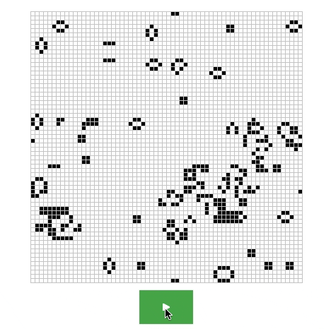

# Conway's Game of Life with Rust and Webassembly

My implementation of Conway's Game of Life with Rust compiled to webassembly
from [here](https://rustwasm.github.io/book/game-of-life/implementing.html).



## Features
- Play and pause animation
- Toggle individual cell state by clicking

## Building

Install [wasm-pack](https://github.com/rustwasm/wasm-pack) and run the following
command:

```shell
wasm-pack build
```

To build the web-client, run the following command:

```shell
cd web && npm install
```

To run the web client (in development mode), run:

```shell
cd web && npm run dev
```

## Running the tests

Run the test suite with the following command

```shell
wasm-pack test --firefox --headless
```
